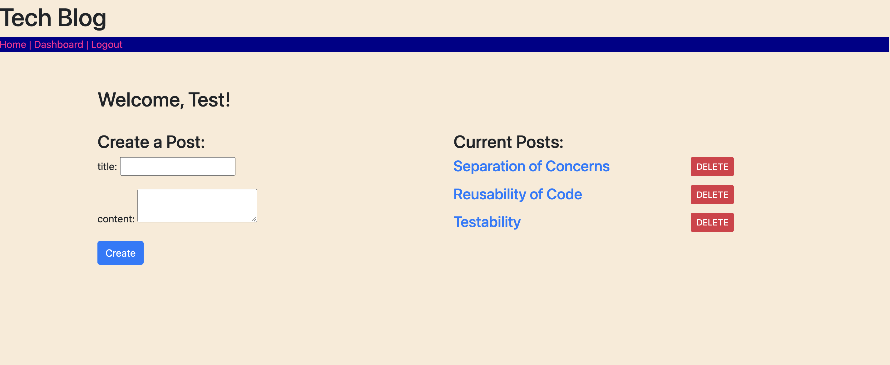

# Tech-Blog-MVC-Paradigm-
A CMS-style blog site similar to a Wordpress site, where developers can publish their blog posts and comment on other developers’ posts as well.

## Table of Contents
* [Technologies](#technologies)
* [Deployed Site](#depoloyed)
* [License](#license)
* [Questions](#questions)

Screenshots:

## Technologies
* Sequelize
* Express.js
* Node.js
* MySQL

## Depoloyed Site
Heroku: https://tech--blog-mvc-paradigm.herokuapp.com/

## License
This repository is not licensed.

## Questions
If you have any questions please contact me at [basitpk10@yahoo.com](mailto:basitpk10@yahoo.com).